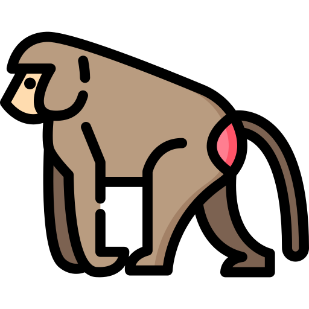

<h2 align="center">
    
</h2>

<p align="center">
    
    
    
    
    
</p>

**Gelada** is a powerful cross-platform console application designed to
automate software plagiarism detection. The interaction is carried out
through a configuration file in `YAML` format. To detect plagiarism, we
use the non-singular likelihood estimation (abbr. *NO LIE*) algorithm.

## Prerequisites

<div align="center">
    <table>
        <thead>
            <tr>
                <th>Component</th>
                <th>Version</th>
                <th>Linux</th>
                <th>macOS</th>
                <th>Windows</th>
            </tr>
        </thead>
        <tbody>
            <tr>
                <td>Bazel</td>
                <td>7.0+</td>
                <td>Required</td>
                <td>Required</td>
                <td>Required</td>
            </tr>
            <tr>
                <td>g++</td>
                <td>12.2+</td>
                <td>Required</td>
                <td>Required</td>
                <td>-</td>
            </tr>
            <tr>
                <td>Make</td>
                <td>4.3+</td>
                <td>Required</td>
                <td>Required</td>
                <td>Required</td>
            </tr>
            <tr>
                <td>MSVC</td>
                <td>19.38+</td>
                <td>-</td>
                <td>-</td>
                <td>Required</td>
            </tr>
            <tr>
                <td>Python</td>
                <td>3.12</td>
                <td>Required</td>
                <td>Required</td>
                <td>Required</td>
            </tr>
        </tbody>
    </table>
</div>

> [!WARNING]
> CPython implementation of Python is required.

## Installation

```
$ git clone https://github.com/syubogdanov/gelada.git
$ cd gelada/
$ make build
$ make install
```

## Getting Started

Let's write the simplest configuration for detecting plagiarism:

```yaml
## workflow.yaml

submissions:
    - name: Student A
      path: ~/some/path/a.py
    - name: Student B
      path: ~/some/path/b.py
```

Now you can use the `Gelada`:

```
$ gelada workflow.yaml -o summary.json
INFO: The summary is available at ~/home/gelada/summary.json
TRACE: 0 hours 0 minutes 10 seconds
```

Let's open the summary:

```json
{
    "summary": [
        {
            "submissions": {
                "cheater": "Student A",
                "author": "Student B"
            },
            "matchings": [
                {
                    "cheated": " ~/some/path/a.py",
                    "confidence": 0.89,
                    "sources": [
                        "~/some/path/b.py"
                    ]
                }
            ]
        },
        {
            "submissions": {
                "cheater": "Student B",
                "author": "Student A"
            },
            "matchings": [
                {
                    "cheated": " ~/some/path/b.py",
                    "confidence": 0.89,
                    "sources": [
                        "~/some/path/a.py"
                    ]
                }
            ]
        }
    ]
}
```

As you can see, two checks were included in the report at once. This is done
intentionally. For example, if you compare repositories with each other, then
you can get independent information about each file, regardless of who is
potentially cheating.

Anyway, let's learn how to disable such double checking if we guarantee that
only one file is always opposed. The `--degree-of-freedom` option is used for
this. It specifies the maximum number of files to be opposed to the given one.

Run the command:

```
$ gelada workflow.yaml -o summary.json ---degree-of-freedom 1 --single-check
INFO: The summary is available at ~/home/gelada/summary.json
TRACE: 0 hours 0 minutes 5 seconds
```

What you get is:

```json
{
    "summary": [
        {
            "submissions": {
                "cheater": "Student A",
                "author": "Student B"
            },
            "matchings": [
                {
                    "cheated": " ~/some/path/a.py",
                    "confidence": 0.89,
                    "sources": [
                        "~/some/path/b.py"
                    ]
                }
            ]
        }
    ]
}
```

## Remote URL

In addition to local directories and files, you can specify remote
repositories. Currently, only GitHub and BitBucket are supported.

```yaml
submissions:
    - name: Student A
      host: GitHub
      user: student-a
      repo: repo-a
    - name: Student B
      host: Bitbucket
      user: student-b
      repo: repo-b
```

Please, note that `repo` case matters. The only valid options are `GitHub` and
`Bitbucket`. Be careful!

## Multiple Submissions

```yaml
submissions:
    - name: Student A
      path: ~/some/path/a.py
    - name: Student B
      path: ~/some/path/b.py
    - name: Student C
      path: ~/some/path/c.py
```

```json
{
    "summary": [
        {
            "submissions": {
                "cheater": "Student A",
                "author": "Student B"
            },
            "matchings": [
                {
                    "cheated": " ~/some/path/a.py",
                    "confidence": 0.89,
                    "sources": [
                        "~/some/path/b.py"
                    ]
                }
            ]
        },
        {
            "submissions": {
                "cheater": "Student A",
                "author": "Student C"
            },
            "matchings": [
                {
                    "cheated": " ~/some/path/A.py",
                    "confidence": 0.46,
                    "sources": [
                        "~/some/path/c.py"
                    ]
                }
            ]
        },
        {
            "submissions": {
                "cheater": "Student B",
                "author": "Student C"
            },
            "matchings": [
                {
                    "cheated": " ~/some/path/b.py",
                    "confidence": 0.39,
                    "sources": [
                        "~/some/path/c.py"
                    ]
                }
            ]
        }
    ]
}
```

## License

Apache-2.0 License, Copyright (c) 2024 Sergei Bogdanov. See [LICENSE](LICENSE)
file.
